# Well-Architected Framework Alignment

> **Status:** Living document — updated with each architectural decision (see ADR process)
> **Framework:** AWS Well-Architected Framework (6 pillars)
> **Scope:** Apollo Discord Bot v3 — monolith with gateway/worker role split, plugin system, multi-instance HA

## Overview

Apollo Discord Bot v3 is a TypeScript/Node.js Discord bot deploying as a monolith with horizontal scaling via gateway/worker role separation. This document maps its architecture to the AWS Well-Architected Framework's six pillars to demonstrate design discipline and identify improvement opportunities.

**Alignment Level:** Substantial — core pillars (Security, Reliability, Operational Excellence) have documented controls; Performance Efficiency and Cost Optimization have implementation evidence; Sustainability is acknowledged with optimization opportunities.

**Methodology:** Each pillar section follows: Design Principles → Apollo Implementation → Evidence Artifacts → Gaps & Remediation.

## Pillar Alignment Summary

```mermaid
graph TD
    A[Apollo v3 Architecture] --> B[Operational Excellence]
    A --> C[Security]
    A --> D[Reliability]
    A --> E[Performance Efficiency]
    A --> F[Cost Optimization]
    A --> G[Sustainability]

    B --> B1[ADR Process]
    B --> B2[SLOs + Error Budgets]
    B --> B3[Runbooks]
    B --> B4[DORA Metrics]
    B --> B5[Fitness Functions]

    C --> C1[Threat Model STRIDE]
    C --> C2[Plugin Sandbox]
    C --> C3[Encryption Rotation]
    C --> C4[Sigstore Verification]

    D --> D1[Leader Election + Fencing]
    D --> D2[Circuit Breakers]
    D --> D3[Chaos Tests]
    D --> D4[Queue Reliability]

    E --> E1[BullMQ Horizontal Scale]
    E --> E2[Redis TTLs + Pool Caps]
    E --> E3[Latency SLIs p95/p99]

    F --> F1[SQLite Single / PG Multi]
    F --> F2[No SaaS Dependencies]
    F --> F3[Ephemeral Data TTLs]

    G --> G1[Efficient Resource Use]
    G --> G2[Graviton/ARM Ready]
```

## Operational Excellence

### Design Principles Applied

1. **Perform operations as code** — Infrastructure as code (Docker, docker-compose), deployment via GitHub Actions, configuration via environment variables.
2. **Annotate documentation** — ADR process (`docs/adr/`), design process (`docs/architecture/design-process.md`), runbooks (`docs/runbooks/`).
3. **Make frequent, small, reversible changes** — Phased implementation (PR #29 67 commits), feature flags via plugin enable/disable, reversible migrations.
4. **Refine operations procedures frequently** — Runbooks for leader failover, Redis outage, queue backlog, migration rollback; chaos test suite validates procedures.
5. **Anticipate failure** — Circuit breakers, leader election fencing, dead-letter queues, SLO error budgets.
6. **Learn from all operational failures** — Post-incident ADR updates, SLO burn-rate alerts, DORA MTTR tracking.

### Apollo Implementation

| Principle | Implementation | Evidence |
|-----------|---------------|----------|
| Operations as code | Docker multi-stage, GitHub Actions CI/CD, pnpm scripts | `Dockerfile`, `.github/workflows/`, `package.json` scripts |
| Annotated documentation | ADRs (7), design process, threat model, SLO policy | `docs/adr/`, `docs/architecture/design-process.md`, `docs/security/threat-model.md`, `docs/observability/slos.md` |
| Small reversible changes | Plugin enable/disable, reversible migrations, phased PRs | `src/core/Plugin.ts`, `src/db/migrations/`, PR #29 |
| Refined procedures | 7 runbooks covering failover, outage, backlog, rollback | `docs/runbooks/*.md` |
| Anticipate failure | Circuit breakers, fencing tokens, dead-letter, SLOs | `src/utils/circuitBreaker.ts`, `src/gateway/fencing.ts`, `src/queue/queue.ts`, `docs/observability/slos.md` |
| Learn from failures | Fitness functions, DORA metrics, error-budget alerts | `tests/architecture/`, DORA workflows, `prometheus/rules/alerts.rules.yml` |

### Evidence Artifacts

- ADR Process: `docs/adr/0000-template.md`, `docs/adr/README.md`, `docs/adr/0001-*.md` through `0007-*.md`
- SLOs & Error Budgets: `docs/observability/slos.md`, `prometheus/rules/slo.rules.yml`, `prometheus/rules/alerts.rules.yml`
- Runbooks: `docs/runbooks/leader-failover.md`, `redis-outage.md`, `queue-backlog.md`, `migration-rollback.md`, `encryption-key-rotation.md`, `nsfw-rust-canary.md`, `alertmanager-dora-integration.md`
- DORA Metrics: `.github/workflows/dora-deployment-metrics.yml`, `dora-mttr-metrics.yml`, `grafana/dashboards/apollo-dora.json`
- Fitness Functions: `tests/architecture/*.test.ts` (26 tests across 6 domains)
- Design Process: `docs/architecture/design-process.md`

### Gaps & Remediation

| Gap | Severity | Remediation |
|-----|----------|-------------|
| No automated runbook execution | Low | Consider RunDeck or GitHub Actions workflow dispatch for common procedures |
| Limited post-incident review template | Low | Add incident retrospective template to `docs/runbooks/` |
| No on-call rotation documentation | Low | Document if team scales beyond solo |

## Security

### Design Principles Applied

1. **Implement a strong identity foundation** — Discord OAuth2 bot token, operator OWNER_IDS, per-plugin capability model.
2. **Enable traceability** — Structured pino logs with correlation IDs, OpenTelemetry tracing, audit logging for admin commands.
3. **Apply security at all layers** — Network (Discord gateway only), application (input validation, parameterized DB), data (encryption at rest via ENCRYPTION_KEY).
4. **Automate security best practices** — Sigstore verification for plugins, dependabot/renovate for dependencies, `pnpm audit` in CI.
5. **Protect data in transit and at rest** — TLS for Discord/Redis/Postgres, ENCRYPTION_KEY rotation for stored secrets.
6. **Keep people away from data** — No direct DB access in production, admin CLI requires OWNER_IDS, plugin sandbox isolates third-party code.
7. **Prepare for security events** — Threat model (`docs/security/threat-model.md`), incident response via runbooks, encryption key rotation procedure.

### Apollo Implementation

| Principle | Implementation | Evidence |
|-----------|---------------|----------|
| Strong identity | Discord bot token, OWNER_IDS, plugin capabilities | `src/utils/startupChecks.ts`, `src/core/Plugin.ts`, `src/core/pluginManifest.ts` |
| Traceability | Pino + OTel, correlation IDs, admin audit log | `src/utils/logger.ts`, `src/observability/otel.ts`, `src/plugins/admin/commands/` |
| Security at all layers | Input validation (zod), parameterized Knex, ENCRYPTION_KEY | `src/utils/validation.ts`, `src/utils/db.ts`, `src/utils/encryption.ts` |
| Automated best practices | Sigstore plugin verification, `pnpm audit`, dependabot | `src/core/pluginSigstore.ts`, `.github/workflows/`, `package.json` |
| Data protection | TLS everywhere, encryption rotation | `config.db`, `config.redis`, `src/utils/encryption.ts`, `docs/runbooks/encryption-key-rotation.md` |
| Least privilege | Plugin sandbox (worker isolation), admin CLI gating | `src/core/worker/workerChild.ts`, `bin/apollo.ts` |
| Incident preparedness | Threat model (8 boundaries), runbooks | `docs/security/threat-model.md`, `docs/runbooks/` |

### Evidence Artifacts

- Threat Model: `docs/security/threat-model.md` (328 lines, mermaid DFD, 8 STRIDE tables)
- Plugin Sandbox: `src/core/Plugin.ts`, `src/core/worker/workerHost.ts`, `src/core/worker/workerChild.ts`, `src/core/pluginManifest.ts`
- Sigstore Verification: `src/core/pluginSigstore.ts` (enforced, no VITEST bypass)
- Encryption: `src/utils/encryption.ts` (rotation via comma-separated ENCRYPTION_KEY)
- Startup Checks: `src/utils/startupChecks.ts` (requires DISCORD_TOKEN, OPERATOR_AGREEMENT, ENCRYPTION_KEY)
- CI Security: `.github/workflows/` includes audit, lint, typecheck

### Gaps & Remediation

| Gap | Severity | Remediation |
|-----|----------|-------------|
| No formal penetration testing | Medium | Schedule annual pen-test if deployed in regulated environments |
| No secrets scanning in CI beyond `pnpm audit` | Low | Add `trivy` or `gitleaks` to CI pipeline |
| Plugin capability model could be more granular | Low | Extend `capability` enum in `pluginManifest.ts` as plugins evolve |

## Reliability

### Design Principles Applied

1. **Automatically recover from failure** — Leader election auto-failover (TTL + fencing), circuit breaker half-open, queue retry with backoff.
2. **Test recovery procedures** — Chaos test suite (`tests/chaos/`) kills Redis, pauses leader, drops endpoints.
3. **Scale horizontally to increase aggregate availability** — Gateway/worker split, BullMQ horizontal workers, Redis-backed EventBus.
4. **Stop guessing capacity** — SLOs with measured targets (p95, p99, availability), DORA lead-time/MTTR metrics.

### Apollo Implementation

| Principle | Implementation | Evidence |
|-----------|---------------|----------|
| Auto recovery | Redis leader lock TTL 10s, heartbeat TTL/3, fencing tokens | `src/gateway/leader.ts`, `src/gateway/fencing.ts` |
| Test recovery | Chaos tests: leader failover, Redis outage, circuit breaker, scheduler dup, external failure, worker restart | `tests/chaos/*.test.ts` (6 tests, gated by `CHAOS_TESTS=1`) |
| Horizontal scale | RUN_MODE=gateway/worker, BullMQ queues, sharding entry | `src/index.ts`, `src/shard.ts`, `src/queue/queue.ts` |
| Measured capacity | 6 SLIs (success ratio, p95/p99 latency, gateway availability, queue reliability, error rate) | `docs/observability/slos.md`, `prometheus/rules/slo.rules.yml` |

### Evidence Artifacts

- Leader Election: `src/gateway/leader.ts`, `src/gateway/fencing.ts` (fencing token monotonicity)
- Circuit Breakers: `src/utils/circuitBreaker.ts` (registry, OpenAI/NSFW/integrations/worker spawn)
- Queue Reliability: `src/queue/queue.ts` (HMAC, 3 retries, exponential backoff, dead-letter), `src/queue/jobs/processCommand.ts`
- SLOs: `docs/observability/slos.md`, `prometheus/rules/slo.rules.yml` (6 recording rules), `prometheus/rules/alerts.rules.yml` (7 burn-rate alerts)
- Chaos Tests: `tests/chaos/leader-failover.test.ts`, `redis-outage.test.ts`, `circuit-breaker.test.ts`, `scheduler-duplication.test.ts`, `external-service-failure.test.ts`, `worker-restart.test.ts`
- Health Endpoints: `src/utils/healthServer.ts` (`/health`, `/ready`, `/metrics` on :9090)
- EventBus: `src/core/EventBus.ts` (Redis pub/sub, at-most-once, plugin.action naming)

### Gaps & Remediation

| Gap | Severity | Remediation |
|-----|----------|-------------|
| No multi-region deployment | Medium | Document as future work; current single-region with Redis/Postgres HA |
| RPO/RTO not formally defined | Low | Add to `docs/observability/slos.md` or create DR runbook |
| Chaos tests run manually (`CHAOS_TESTS=1`) | Low | Integrate into CI nightly schedule |

## Performance Efficiency

### Design Principles Applied

1. **Democratize advanced technologies** — BullMQ for queue, ioredis for Pub/Sub, OpenTelemetry for observability, TypeScript strict mode for correctness.
2. **Go global in minutes** — Docker image multi-arch (amd64/arm64), single binary deployment, config via env vars.
3. **Use serverless architectures where appropriate** — Not applicable (long-lived gateway connection required), but worker jobs are ephemeral.
4. **Experiment more often** — Fitness functions validate SLIs continuously, feature flags via plugin system.

### Apollo Implementation

| Principle | Implementation | Evidence |
|-----------|---------------|----------|
| Advanced tech | BullMQ + Redis, OTel + Prometheus, strict TS, Knex | `src/queue/`, `src/observability/`, `tsconfig.json`, `src/utils/db.ts` |
| Global deployment | Docker multi-stage, node:26-alpine, arm64 support | `Dockerfile`, `docker-compose.yml` |
| Experimentation | Plugin system, fitness functions, DORA metrics | `src/plugins/`, `tests/architecture/`, DORA workflows |

### Measured Performance

| Metric | Target (SLO) | Current Measurement |
|--------|--------------|---------------------|
| Command latency p95 | ≤ 2.0s | `apollo_command_duration_seconds_bucket` histogram |
| Command latency p99 | ≤ 5.0s | `apollo_command_duration_seconds_bucket` histogram |
| Gateway availability | ≥ 99.5% | `apollo_gateway_connected` gauge |
| Queue job reliability | ≥ 99% | `apollo_queue_jobs_total{outcome}` counter |
| Error rate | < 1% | `apollo_errors_total / apollo_commands_total` |

### Evidence Artifacts

- Metrics: `src/utils/metrics.ts` (Prometheus histograms, gauges, counters)
- Queue: `src/queue/queue.ts` (BullMQ config: attempts=3, backoff=1s, removeOnComplete)
- Database: `src/utils/db.ts` (Knex pool max 80% of Postgres `max_connections`)
- SLO Recording Rules: `prometheus/rules/slo.rules.yml` (6 rules, 30-day rolling)
- Grafana Dashboard: `grafana/dashboards/apollo-slo.json` (8 panels)

### Gaps & Remediation

| Gap | Severity | Remediation |
|-----|----------|-------------|
| No caching strategy documented | Medium | Add Redis caching layer for frequent reads (guild config, user data) |
| No load testing / capacity planning | Medium | Add k6 or artillery tests; define max guilds per gateway pod |
| Database query optimization not measured | Low | Add `apollo_db_query_duration_seconds` histogram buckets for p99 |
| No CDN for static assets (transcripts, exports) | Low | Not needed at current scale; document decision |

## Cost Optimization

### Design Principles Applied

1. **Implement cloud financial management** — Not applicable (self-hosted); costs are infrastructure (VPS, Redis, Postgres).
2. **Adopt a consumption model** — Horizontal scaling via worker pods; pay for what you use.
3. **Measure overall efficiency** — DORA metrics (deployment frequency, lead time), resource metrics (worker memory, Redis connections).
4. **Stop spending money on undifferentiated heavy lifting** — Self-hosted Discord gateway, open-source stack (no SaaS bot platforms).
5. **Analyze and attribute expenditure** — Prometheus metrics expose resource usage; Grafana dashboards visualize.

### Apollo Implementation

| Principle | Implementation | Evidence |
|-----------|---------------|----------|
| Consumption model | Worker pods scale with queue depth; SQLite for single-instance | `src/queue/queue.ts`, `config.db` |
| Measure efficiency | DORA metrics, Prometheus resource metrics | DORA workflows, `src/utils/metrics.ts` (workerMemoryUsage, redisConnections) |
| Avoid undifferentiated work | Open-source stack, no managed bot platform | Entire codebase |
| Attribute expenditure | Metrics per pod, per shard, per queue | `src/utils/metrics.ts` labels |

### Evidence Artifacts

- DORA Metrics: `.github/workflows/dora-deployment-metrics.yml`, `dora-mttr-metrics.yml`, `grafana/dashboards/apollo-dora.json`
- Resource Metrics: `src/utils/metrics.ts` (workerMemoryUsage, redisConnections, activePlugins, queueDepth)
- Deployment: `Dockerfile`, `docker-compose.yml` (profiles: bot, nsfw, interlink)
- Database Choice: SQLite (zero cost) for single instance; Postgres for multi-instance

### Gaps & Remediation

| Gap | Severity | Remediation |
|-----|----------|-------------|
| No FinOps tracking / cost allocation | Medium | Add cost estimation to `docs/architecture/design-process.md`; consider `kubecost` if on K8s |
| No budget alerts | Low | Add Prometheus alert on `workerMemoryUsage` > threshold |
| SQLite/Postgres split undermines dev/prod parity | Medium | Document in ADR 0002; consider testcontainers for CI Postgres |

## Sustainability

### Design Principles Applied

1. **Understand your impact** — Node.js 26 on Alpine Linux (small image), efficient event-loop architecture, minimal dependencies.
2. **Establish sustainability goals** — Not formally documented; implicit in resource efficiency.
3. **Maximize utilization** — Horizontal worker scaling, Redis TTLs prevent memory leaks, DB pool caps.
4. **Anticipate and adopt new, more efficient hardware/software** — ARM64 Docker images, Node.js LTS upgrades, pnpm for fast installs.
5. **Use managed services where appropriate** — Not applicable (self-hosted); but Redis/Postgres can be managed.
6. **Reduce downstream impact** — Efficient Discord API usage (batch requests, cache guild data), minimal payload sizes (msgpackr).

### Apollo Implementation

| Principle | Implementation | Evidence |
|-----------|---------------|----------|
| Understand impact | Alpine base, Node 26, msgpackr serialization, pnpm | `Dockerfile`, `src/queue/queue.ts`, `package.json` |
| Maximize utilization | Worker pool, TTLs, pool caps, connection pooling | `src/queue/queue.ts`, `src/utils/db.ts`, `config.redis` |
| Adopt efficient hardware | ARM64 multi-arch Docker, pnpm, TypeScript strict | `Dockerfile`, `pnpm-workspace.yaml`, `tsconfig.json` |
| Reduce downstream impact | Guild data caching, batched Discord requests | `src/utils/db.ts` (getGuildData), `src/plugins/` command handlers |

### Evidence Artifacts

- Docker: `Dockerfile` (node:26-alpine, multi-stage, ~100MB final)
- Serialization: `src/queue/queue.ts` (msgpackr, compact binary)
- Package Manager: `pnpm-workspace.yaml` (fast, deduplicated, hoisted)
- Resource Limits: `src/gateway/leader.ts` (TTL 10s), `src/utils/db.ts` (pool 80% max_connections)
- Discord Efficiency: `src/utils/db.ts` (guild/user data caching), command handlers use `fetch` over `fetchAll`

### Gaps & Remediation

| Gap | Severity | Remediation |
|-----|----------|-------------|
| No carbon/energy metrics | Low | Not feasible at self-hosted scale; document as out of scope |
| No sustainability goals documented | Low | Add to `docs/architecture/design-process.md` Phase 2 evaluation criteria |
| ARM64 not tested in CI | Medium | Add ARM64 build test to `.github/workflows/docker.yml` |

## Cross-Pillar Traceability Matrix

| Artifact | OpEx | Security | Reliability | Perf | Cost | Sustainability |
|----------|------|----------|-------------|------|------|----------------|
| ADR Process | Yes | | | | | |
| SLOs + Error Budgets | Yes | | Yes | Yes | | |
| Threat Model | | Yes | | | | |
| Plugin Sandbox | | Yes | | | | |
| Leader Election + Fencing | Yes | | Yes | | | |
| Circuit Breakers | | | Yes | | | |
| Chaos Tests | Yes | | Yes | | | |
| Runbooks | Yes | Yes | Yes | | | |
| DORA Metrics | Yes | | | Yes | Yes | |
| Fitness Functions | Yes | | Yes | Yes | | |
| Health Endpoints | Yes | | Yes | | | |
| Encryption Rotation | | Yes | | | | |
| Sigstore Verification | | Yes | | | | |
| BullMQ + Redis | | | Yes | Yes | Yes | Yes |
| SQLite / PG Dual DB | | | | | Yes | |
| ARM64 Docker | | | | | | Yes |
| msgpackr Serialization | | | | Yes | | Yes |

## Conclusion

Apollo Discord Bot v3 demonstrates **substantial alignment** with the AWS Well-Architected Framework across all six pillars. The strongest pillars are **Security**, **Reliability**, and **Operational Excellence**, each with documented controls, automated validation, and operational procedures. **Performance Efficiency** has measured SLIs and horizontal scaling. **Cost Optimization** and **Sustainability** are addressed through architectural choices (self-hosted, consumption model, efficient serialization) but lack formal tracking.

### Alignment Scorecard

| Pillar | Alignment | Confidence |
|--------|-----------|------------|
| Operational Excellence | High | 90% — ADRs, SLOs, runbooks, DORA, fitness functions |
| Security | High | 85% — Threat model, sandbox, Sigstore, encryption, least privilege |
| Reliability | High | 85% — Auto-failover, circuit breakers, chaos tests, SLOs |
| Performance Efficiency | Medium | 75% — SLIs measured, horizontal scale, no caching strategy |
| Cost Optimization | Medium | 60% — Efficient choices, no FinOps tracking |
| Sustainability | Medium | 65% — Efficient runtime, ARM64 ready, no formal goals |

### Maintenance

- **Update on every ADR** — When a new ADR is created, update the relevant pillar section and traceability matrix.
- **Review quarterly** — Verify artifact links, update gap status, reassess alignment scores.
- **Version with architecture** — Document lives in `docs/architecture/` alongside ADRs and design process.
