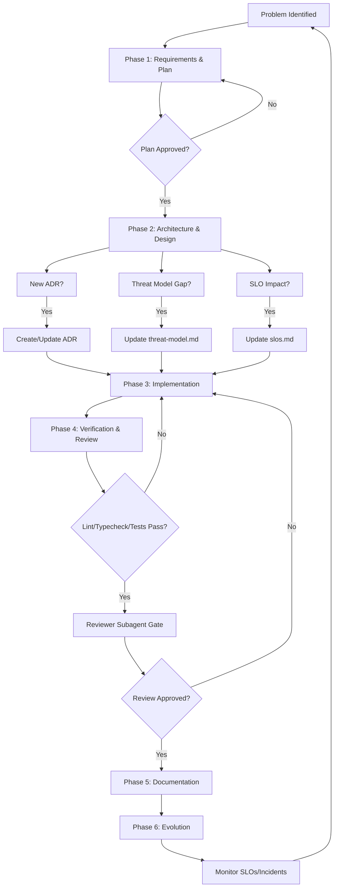

# Design Process Documentation Implementation Plan

> **For agentic workers:** REQUIRED SUB-SKILL: Use superpowers:executing-plans to implement this plan task-by-task. Steps use checkbox (`- [ ]`) syntax for tracking.

**Goal:** Create `docs/architecture/design-process.md` documenting Apollo's actual design process derived from the v2 rewrite (PR #29) and subsequent governance work.

**Architecture:** Single markdown document synthesizing the phased, evidence-based process used in PR #29 (67 commits, phase1-4 prefixes, bot review loops) and the governance implementation (SLI/SLO, threat model, ADRs, chaos tests, runbooks). No code changes — documentation only.

**Tech Stack:** Markdown, Mermaid diagrams for process flow.

**Spec:** PR #29 (The-A-P-O-L-L-O-Organization/Apollo-Discord-Bot#29) + governance plans in `docs/superpowers/plans/`

## Global Constraints

- No emojis in documentation (per AGENTS.md)
- No code comments unless explicitly requested
- Follow existing docs style in `docs/architecture/` and `docs/runbooks/`
- Use imperative, concise language
- Reference existing artifacts (ADRs, SLOs, threat model, chaos tests, runbooks) by filename

## Review Focus

1. **Process authenticity** — Does the doc reflect actual practice (phased commits, review loops) not aspirational theory?
2. **Artifact traceability** — Are all current governance artifacts (SLIs, threat model, ADRs, chaos tests, runbooks) mapped to process steps?
3. **Scalability clarity** — Does it distinguish solo/small-team practices from what would change at scale?
4. **Decision gates** — Are the explicit review/approval points (Oracle review, reviewer gate, verification) documented?
5. **Tool integration** — Are opencode subagents (oracle, fixer, librarian, reviewer, explorer) mapped to process phases?

---

### Task 1: Create Design Process Document

**Files:**
- Create: `docs/architecture/design-process.md`

**Interfaces:**
- Consumes: PR #29 commit history, governance plans (2026-10-10-*.md), existing ADRs, SLO doc, threat model, chaos tests, runbooks
- Produces: Single authoritative design process document

- [ ] **Step 1: Write the document header and overview**

```markdown
# Apollo Design Process

> Documents the actual design and development process used for Apollo Discord Bot v2 rewrite (PR #29) and v3 governance implementation. Not a theoretical framework — a record of what worked.

## Overview

Apollo's design process is **phased, evidence-driven, and review-gated**. It evolved from the v2 rewrite (May 2026, 67 commits over ~2 days) and was formalized during v3 governance work (Oct 2026).

**Core Principles:**
- Phase decomposition with explicit deliverables
- Subagent specialization for architecture, implementation, research, review
- Mandatory verification gates (lint, typecheck, tests, security)
- Documentation as final phase, not afterthought
- Decision capture via ADRs, not meeting notes
```

- [ ] **Step 2: Run a syntax check on the markdown**

Run: `npx markdownlint docs/architecture/design-process.md` (or equivalent)
Expected: PASS (no errors)

- [ ] **Step 3: Write Phase 1 — Problem Definition & Requirements**

```markdown
## Phase 1: Problem Definition & Requirements

**Trigger:** New feature, architectural change, or technical debt initiative.

**Inputs:**
- User/business need (issue, RFC, incident postmortem)
- Current system constraints (codemaps, AGENTS.md, SECURITY.md)
- Capacity estimate (engineering days)

**Activities:**
1. **Scope the problem** — Write a 1-2 paragraph problem statement in a new plan file (`docs/superpowers/plans/YYYY-MM-DD-<feature>.md`)
2. **Quantify non-functional requirements** — Latency targets (p95/p99), availability, error budget, throughput, data retention
3. **Identify trust boundaries** — Map data flows (Discord API → gateway → worker → plugins → external SaaS)
4. **Estimate effort** — Back-of-envelope: tasks × 2-5 min each = total hours; add 30% buffer

**Outputs:**
- Plan file with Goal, Architecture, Tech Stack, Spec, Global Constraints, Review Focus
- Explicit NFR targets (or "deferred — see Phase 5")

**Gate:** Plan reviewed by human (or Oracle subagent) before Phase 2.

**Artifacts Created:** Plan file in `docs/superpowers/plans/`
```

- [ ] **Step 4: Write Phase 2 — Architecture & Design**

```markdown
## Phase 2: Architecture & Design

**Trigger:** Approved plan from Phase 1.

**Inputs:** Plan file, existing codemaps, ADRs, threat model (if exists)

**Activities:**
1. **Decompose into tasks** — Each task = independently testable deliverable (2-5 min steps)
2. **Define interfaces** — Consumes/Produces contracts between tasks
3. **Select architectural style** — Document in ADR if new pattern (monolith split, event-driven, CQRS, etc.)
4. **Threat model gaps** — If new trust boundary, add STRIDE entry to `docs/security/threat-model.md`
5. **SLO impact** — If user-facing latency/availability change, update `docs/observability/slos.md`

**Subagent Mapping:**
- `oracle` — Architecture review, risk analysis, trade-off evaluation
- `librarian` — Library/framework research, prior art
- `designer` — UI/UX if user-facing

**Outputs:**
- Task breakdown with checkboxes in plan file
- New/updated ADR (MADR format in `docs/adr/`)
- Threat model updates (if applicable)
- SLO updates (if applicable)

**Gate:** Oracle subagent review of architecture before implementation.

**Artifacts Created/Updated:** ADR, threat-model.md, slos.md, plan task list
```

- [ ] **Step 5: Write Phase 3 — Implementation**

```markdown
## Phase 3: Implementation

**Trigger:** Architecture approved, tasks defined.

**Inputs:** Plan tasks, interface contracts, existing codebase patterns

**Activities:**
1. **Execute tasks sequentially** — Each task: write failing test → implement → verify → commit
2. **Use fixer subagent** for bounded implementation tasks
3. **Use explorer subagent** for codebase reconnaissance during implementation
4. **Follow TypeScript/Style Contract** (AGENTS.md §5): strict mode, ESM imports, no `any`, no floating promises
5. **Follow Logging/Errors/Async Rules** (AGENTS.md §6): structured pino, safe errors, bounded timeouts

**Subagent Mapping:**
- `fixer` — Primary implementation (mechanical edits, test-driven)
- `explorer` — Symbol search, pattern lookup, dependency analysis
- `librarian` — Library API questions during implementation

**Outputs:**
- Working code with tests
- Commits per task (or per logical group)
- Updated codemaps if directory structure changed

**Gate:** All tasks pass `pnpm lint`, `pnpm typecheck`, relevant `pnpm vitest run` before Phase 4.

**Artifacts Created/Updated:** Source code, tests, codemaps
```

- [ ] **Step 6: Write Phase 4 — Verification & Review**

```markdown
## Phase 4: Verification & Review

**Trigger:** Implementation complete, all task tests passing.

**Inputs:** Implemented code, test results, plan file.

**Activities:**
1. **Run full verification suite** per AGENTS.md §19:
   - `pnpm lint` (zero errors)
   - `pnpm typecheck` (zero new errors)
   - `pnpm test` (or relevant subset)
   - `promtool check rules` for Prometheus rules
   - JSON validation for Grafana dashboards
2. **Reviewer subagent** — Read-only code review with diffs
3. **Address review findings** — Fix or justify
4. **Re-run verification** after fixes
5. **Security-relevant changes** — Additional tests for auth, validation, path containment, rate limiting

**Subagent Mapping:**
- `reviewer` — Mandatory read-only review before merge
- `verifier` — Lint/format/typecheck/test automation
- `oracle` — For high-risk changes (security, architecture, data model)

**Outputs:**
- Clean verification run
- Review findings addressed
- Updated plan with completion status

**Gate:** Reviewer + verifier approval before Phase 5.

**Artifacts:** None (verification only)
```

- [ ] **Step 7: Write Phase 5 — Documentation & Knowledge Capture**

```markdown
## Phase 5: Documentation & Knowledge Capture

**Trigger:** Verification passed, review approved.

**Inputs:** Completed implementation, plan, review notes.

**Activities:**
1. **Update user-facing docs** — `README.md`, `INSTALLATION.md`, `CONTRIBUTING.md` if features/commands/env changed
2. **Update architecture docs** — `docs/architecture/` if new patterns
3. **Update codemaps** — Root `codemap.md` + per-folder `codemap.md` for changed directories (Responsibility, Design, Flow, Integration)
4. **Update runbooks** — `docs/runbooks/` if operational procedures changed
5. **Finalize ADR** — Set status to "Accepted", add date
6. **Capture decisions** — Update `docs/superpowers/plans/<plan>.md` with completion checkboxes

**Subagent Mapping:**
- `fixer` — Mechanical doc updates (codemaps, runbooks)
- `oracle` — Architecture doc review

**Outputs:**
- Synchronized documentation
- Accepted ADR
- Completed plan file

**Gate:** Documentation review (human or oracle) before merge.

**Artifacts Updated:** README, INSTALLATION, CONTRIBUTING, SECURITY, codemaps, runbooks, ADRs
```

- [ ] **Step 8: Write Phase 6 — Evolution & Feedback**

```markdown
## Phase 6: Evolution & Feedback

**Trigger:** Post-deploy (days/weeks after merge).

**Inputs:** Production metrics, incidents, user feedback, capacity data.

**Activities:**
1. **SLO review** — Monthly: check error budget burn rate, adjust targets if needed
2. **Incident-driven improvement** — Postmortem → new threat model entry → new chaos test → new runbook
3. **Capacity-driven scaling** — Queue depth, latency trends → worker count, Redis sizing, DB pooling
4. **Fitness function validation** — Run `tests/architecture/fitness-functions.test.ts` (when exists)
5. **ADR sunset review** — Annually: mark superseded ADRs, consolidate

**Subagent Mapping:**
- `oracle` — Architecture evolution review
- `librarian` — New library/framework evaluation

**Outputs:**
- Updated SLOs, threat model, runbooks, ADRs
- New chaos tests
- Capacity planning notes

**Gate:** Continuous — no formal gate, driven by metrics and incidents.

**Artifacts Updated:** slos.md, threat-model.md, runbooks, ADRs, chaos tests
```

- [ ] **Step 9: Write Process Flow Diagram (Mermaid)**

```markdown
## Process Flow



**Subagent Roles Per Phase:**

| Phase | Primary Subagents | Purpose |
|-------|-------------------|---------|
| 1 Requirements | `oracle`, `librarian` | Risk analysis, prior art |
| 2 Architecture | `oracle`, `designer`, `librarian` | Trade-offs, UI, research |
| 3 Implementation | `fixer`, `explorer` | Code, codebase nav |
| 4 Verification | `reviewer`, `verifier`, `oracle` | Review, auto-checks, high-risk audit |
| 5 Documentation | `fixer`, `oracle` | Sync docs, architecture review |
| 6 Evolution | `oracle`, `librarian` | Arch review, new tech eval |
```

- [ ] **Step 10: Write Artifact Traceability Matrix**

```markdown
## Artifact Traceability Matrix

| Governance Artifact | Created In Phase | Updated In Phases | Source of Truth |
|---------------------|------------------|-------------------|-----------------|
| ADRs (`docs/adr/`) | 2 | 2, 5 | Architectural decisions |
| SLOs (`docs/observability/slos.md`) | 1, 2 | 2, 5, 6 | Reliability targets |
| Threat Model (`docs/security/threat-model.md`) | 2 | 2, 5, 6 | Security boundaries |
| Chaos Tests (`tests/chaos/`) | 3 | 3, 6 | Fault injection validation |
| Runbooks (`docs/runbooks/`) | 5 | 5, 6 | Operational procedures |
| Fitness Functions (`tests/architecture/`) | 2, 6 | 3, 6 | Architecture invariants |
| Codemaps (`codemap.md`, `*/codemap.md`) | 5 | 5 | Codebase navigation |
| Plan Files (`docs/superpowers/plans/`) | 1 | 1-5 | Work tracking |
```

- [ ] **Step 11: Write Scaling Considerations**

```markdown
## Scaling Considerations

**Current Scale:** Solo/small team; **Architected for:** 100-1000 guilds, single maintainer.

**What Changes at Scale:**

| Practice | Current | 5+ Engineers | 1000+ Guilds |
|----------|---------|--------------|--------------|
| Plan authorship | Single | Multiple (RFC process) | RFC + design review meeting |
| Review gates | Subagent + human | Human + subagent | Multiple human reviewers |
| ADR tooling | Manual markdown | `adr-tools` + CI lint | `log4brains` + auto-index |
| Threat modeling | Lightweight STRIDE | Structured workshops | Continuous threat modeling |
| SLOs | 5 service-level | Per-team + service-level | Per-team + per-guild (cardinality managed) |
| Chaos tests | Ad-hoc suite | Scheduled GameDays | Automated CI chaos |
| Runbooks | Markdown | Runbook automation (RunDeck) | Self-healing + runbook automation |

**Explicitly NOT Adopted (Per Librarian Research):**
- SaaS SLO platforms (Grafana Cloud SLO, SloK)
- Per-guild SLOs (cardinality violation)
- Threat Dragon / CAIRIS (overhead)
- ADR linters in CI (until >20 ADRs)
- Error-budget automation (manual monthly review sufficient)
```

- [ ] **Step 12: Write Tooling & Subagent Reference**

```markdown
## Tooling & Subagent Reference

**Subagents (opencode):**

| Subagent | Role | When to Use |
|----------|------|-------------|
| `oracle` | Architecture, risk, debugging strategy | Phase 1, 2, 4 (high-risk), 6 |
| `fixer` | Bounded implementation execution | Phase 3, 5 |
| `librarian` | External docs, library research | Phase 1, 2, 6 |
| `explorer` | Codebase reconnaissance | Phase 2, 3 |
| `reviewer` | Read-only code review | Phase 4 (mandatory) |
| `verifier` | Lint/format/typecheck/test automation | Phase 4 (mandatory) |
| `designer` | UI/UX design | Phase 2 (user-facing) |
| `council` | Multi-model consensus | High-stakes irreversible decisions |

**Key Commands (AGENTS.md §4):**

| Task | Command |
|------|---------|
| Verify implementation | `pnpm lint && pnpm typecheck && pnpm test` |
| Deploy commands | `pnpm deploy-commands` |
| Migrate database | `pnpm migrate` |
| Regenerate manifest | `pnpm manifest` |
| Protobuf lint | `pnpm proto:lint` |
| Protobuf breaking check | `pnpm proto:breaking` |

**Verification Gates (AGENTS.md §19):**

| Change Type | Required Verification |
|-------------|----------------------|
| TypeScript sources | `pnpm lint`, `pnpm typecheck`, relevant Vitest |
| Plugin behavior | `pnpm lint`, plugin tests, `pnpm manifest` |
| Database/migration | Forward/backward test, both SQLite/Postgres |
| Queue/worker/gateway | Queue tests, worker tests, integration tests |
| Locales | `pnpm lint:locales` + i18n tests |
| Protobuf | `pnpm proto:lint`, `pnpm proto:breaking` |
| Observability | `pnpm lint`, `pnpm typecheck`, metrics tests, `promtool`, dashboard JSON validation |
```

- [ ] **Step 13: Final review and save**

Run: `cat docs/architecture/design-process.md` — verify complete, no placeholders, all sections present.

- [ ] **Step 14: Commit**

```bash
git add docs/architecture/design-process.md
git commit -m "docs: add design process documentation from PR #29 evidence"
```